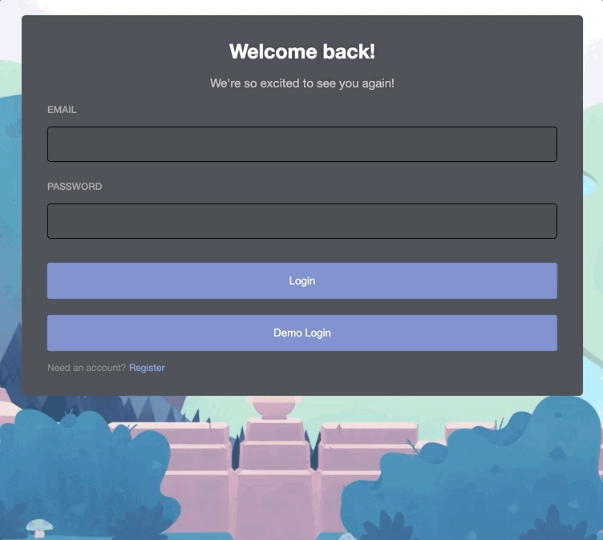
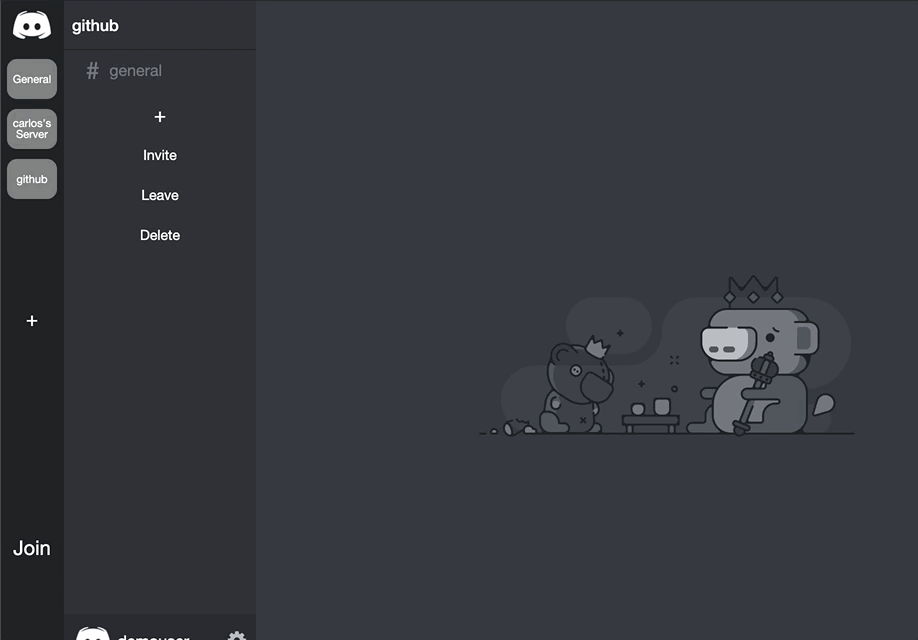

# KISCORD

Kiscord is a clone of the popular live chat/message application Discord. Kiscord allows users that can create private servers and channels where you can chat/message with other users.

[Kiscord Live Demo](https://kiscord.herokuapp.com/#/)

# Technologies

* React-Redux
* Ruby on Rails
* PostgreSQL
* CSS/HTML

# Features

## User Authentication

Users can create/login with unique credentials that can be used to access the full functionality of the application. Login/Signup of users check for validations and render the related errors on the page. A demo login is available to check out different features the application has to offer.

## Servers

Servers can be created by users. Users can also delete and or leave said servers, as well as invite your friends with a unique invite code.

## Channels

Servers all have a default general channel, but users can create channels inside each server that the user is a part of.

## Live Chat

Users can talk to other users on the same channel via live chat.
